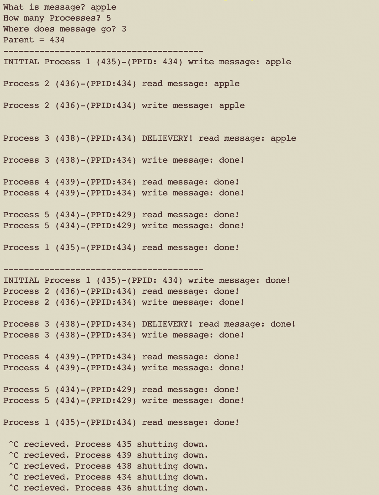
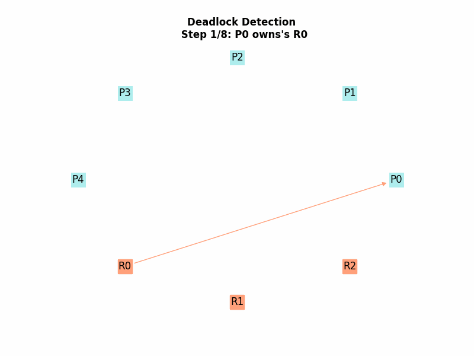
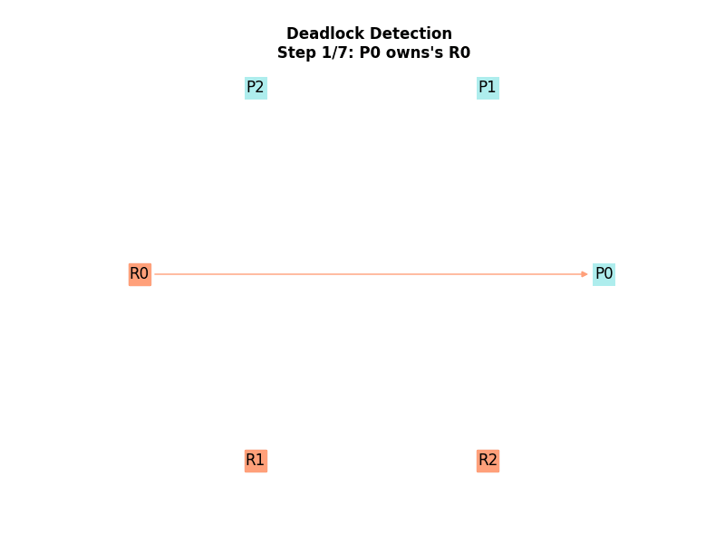
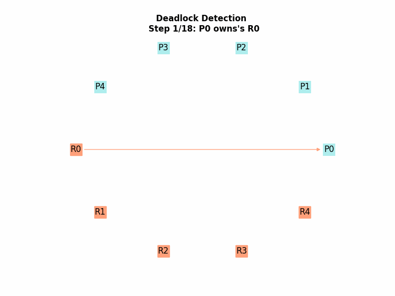
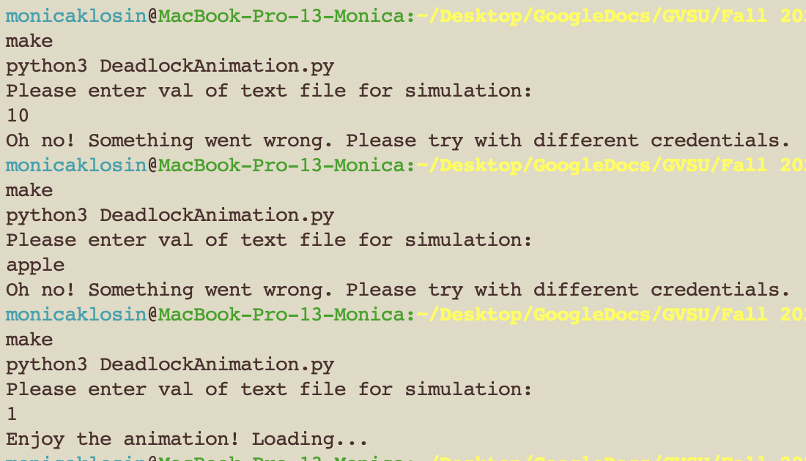

# Operating-Systems

### Repo for GVSU 452 Operating systems.
Repo holds code from projects and activities.

______________________________________________________________________________

#### token-ring project

[run in terminal with: ./makeBFile]
______________________________________________________________________________
####  Deadlock Detection project

- simulation with test file scenario-1

 
- simulation with test file scenario-2

 
- simulation with test file scenario-3

 

[run in terminal with: make ]  
test user inputs:  
  
(user input is the integer in the text file, ie if user types "1", then the animation will run with scenario-1.txt)

______________________________________________________________________________

Last Updated: Nov 22, 2020  
